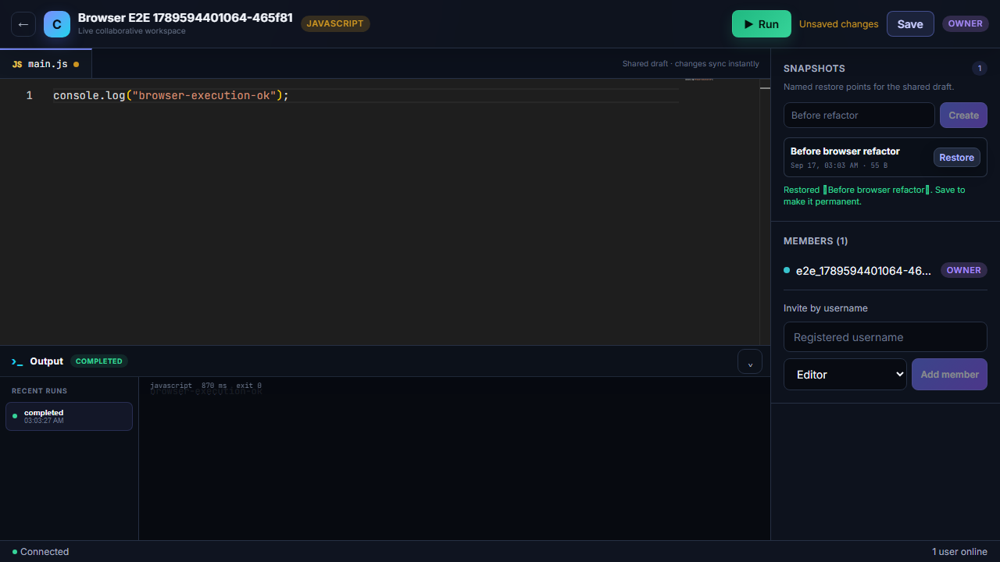
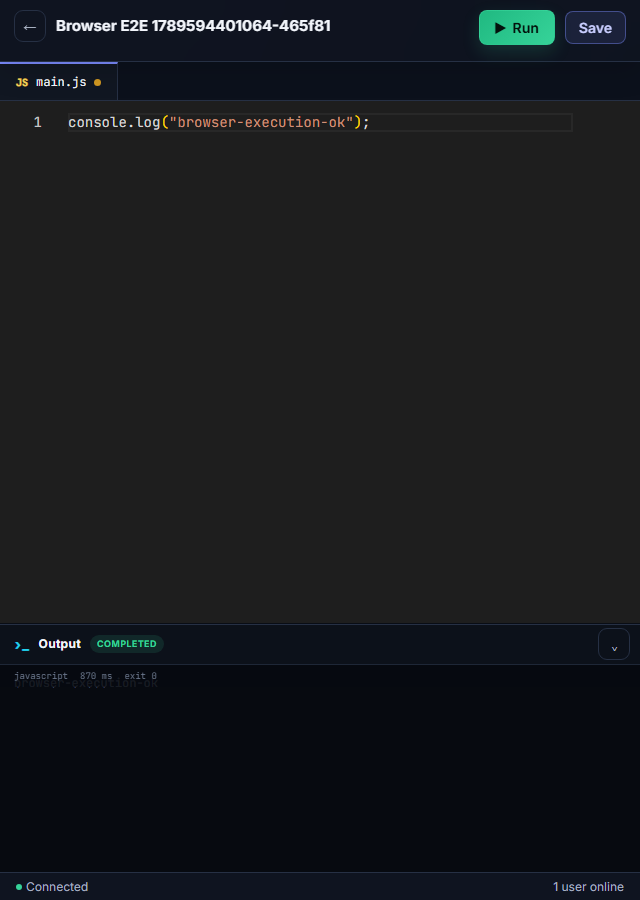
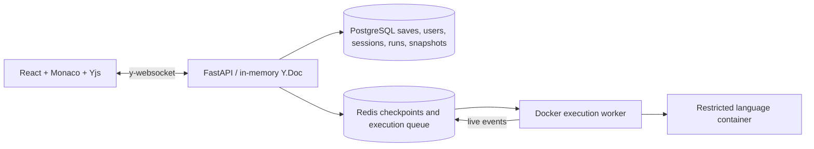

# Concord

Concord is a collaborative code editor and sandboxed execution platform built
with React, Monaco, Yjs, FastAPI, pycrdt, PostgreSQL, Redis, and Docker. Teams
can edit a shared document, manage roles, explicitly save durable versions, and
run Python, JavaScript, or C++ with live terminal output.



<details>
<summary>Mobile workspace</summary>



</details>

## Engineering highlights

- CRDT-based editor synchronization with live cursors, reconnect recovery, and
  server-enforced owner/editor/viewer permissions.
- Isolated Python, JavaScript, and C++ execution with live output, cancellation,
  timeouts, no network, a read-only filesystem, non-root users, and hard
  CPU/memory/process limits.
- 100% measured WebSocket update delivery at 100 concurrent clients in the
  retained local benchmark, with 748 ms p95 latency and 108 MB peak backend
  memory.
- 91 backend tests, an 85% business-logic coverage gate, 11 frontend component
  tests, browser E2E, security smoke tests, and automated Docker builds in CI.

## Current status

- Milestone 1: complete. Authenticated collaboration, RBAC, presence,
  reconnection, recovery checkpoints, explicit saves, and live authorization
  revocation are covered by automated and live tests.
- Milestone 2: complete. The persisted execution state machine, reliable Redis
  queue, isolated Docker worker, Python/JavaScript/C++ runtimes, live output,
  cancellation, timeout enforcement, resource limits, execution history, and
  terminal UI are implemented.
- Milestone 3: complete. Named snapshots and live restore, an 80% business-logic
  coverage gate, frontend component/browser tests, GitHub Actions, reproducible
  WebSocket/execution/snapshot benchmarks, and the Redis fan-out scaling design
  and prototype are included.

Collaboration deliberately runs in one backend process. Its in-memory Y.Doc is
authoritative while users are connected, periodically checkpointed to Redis for
crash recovery, and saved to PostgreSQL when an editor explicitly saves. Multiple
Uvicorn workers are not supported in V1.



## Run locally

Requirements: Docker Desktop and Docker Compose.

```powershell
docker compose up -d --build
docker compose ps --all
```

Open <http://localhost:5173>. The API health endpoint is
<http://localhost:8000/health>.

For a public HTTPS deployment with the full Docker execution worker, follow the
[Oracle Cloud Always Free guide](docs/oracle-deployment.md). The production
stack keeps PostgreSQL and Redis private and uses Caddy for automatic TLS plus
same-origin API/WebSocket routing.

The migration service runs `alembic upgrade head` before the backend starts.
PostgreSQL and Redis use host ports `5433` and `6380` by default so they can
coexist with common local installations. Override them when needed:

```powershell
$env:POSTGRES_PORT = "15432"
$env:REDIS_PORT = "16379"
$env:JWT_SECRET = "replace-with-a-long-random-development-secret"
docker compose up -d
```

For source-mounted hot reload:

```powershell
docker compose -f docker-compose.yml -f docker-compose.dev.yml up --build
```

## Verify

Backend:

```powershell
cd backend
.\venv\Scripts\python.exe -m pytest -q
.\venv\Scripts\python.exe -m pytest --cov=app --cov-fail-under=80
.\venv\Scripts\ruff.exe check app tests benchmarks
.\venv\Scripts\ruff.exe format --check app tests benchmarks
```

Frontend:

```powershell
cd frontend
npm.cmd run build
npm.cmd run lint
npm.cmd test
```

With the Compose stack running, exercise auth, RBAC, three simultaneous Yjs
clients, presence, viewer write/save rejection, reconnect, explicit save, and
Redis recovery. It also verifies shared save metadata plus connected-client
demotion, removal, and session-close enforcement:

```powershell
cd frontend
npm.cmd run smoke:collaboration
npm.cmd run smoke:execution
npx.cmd playwright install chromium
npm.cmd run test:e2e
```

The execution smoke test covers incremental output, all three languages,
compiler errors, cancellation, timeout, network isolation, the hard memory
limit, and sandbox cleanup. The browser flow covers Monaco editing, Run and
terminal output in addition to saves, invitations, role changes, and removal.

## Snapshots

Editors and owners can create a named snapshot from the right sidebar. Every
member can browse snapshot metadata. Restoring emits an ordinary Yjs edit, so
connected peers converge immediately; the restored draft remains marked
unsaved until an editor explicitly saves it to PostgreSQL.

## Benchmarks

With Compose running, execute the default Milestone 3 sweep from `backend/`:

```powershell
.\venv\Scripts\python.exe -m benchmarks.bench_websocket
.\venv\Scripts\python.exe -m benchmarks.bench_execution
.\venv\Scripts\python.exe -m benchmarks.bench_snapshots
```

Results are written as timestamped JSON plus Markdown tables under
`backend/benchmarks/results/`. See [benchmark options](backend/benchmarks/README.md)
and the [horizontal-scaling design](docs/horizontal-scaling.md). Generated
numbers are environment-specific and are intentionally not presented as
universal performance claims.

Latest local Docker baseline (September 17, 2026): 100 WebSocket clients
connected with 100% measured update delivery (p95 748 ms, 108 MB peak backend
memory); the single execution worker sustained about 1.9 jobs/s at 20 queued
jobs with no timeouts; a 1 MB snapshot created in 48 ms and restored in 40 ms.
Raw measurements and every sweep level are retained in the results directory.

## Configuration

Frontend build variables are documented in `frontend/.env.example`:

- `VITE_API_URL`
- `VITE_WS_URL` (the default includes the `/ws` prefix)

Backend variables are documented in `backend/.env.example`. Never commit a real
`.env`; repository and Docker ignore files exclude secrets and generated files.
Recovery checkpoints expire after seven days by default; configure
`CRDT_CHECKPOINT_TTL_SECONDS` to change that retention window.

The execution worker needs access to a Docker daemon to create restricted
sandbox containers. It can be run from the host with:

```powershell
cd backend
.\venv\Scripts\python.exe -m app.execution.worker
```

The Compose worker mounts `/var/run/docker.sock`, which effectively grants the
trusted worker control of the Docker daemon. User code never receives that
socket; it runs in separate restricted containers.

## Delivery pipeline

`.github/workflows/ci.yml` runs Ruff, the backend business-logic coverage gate,
frontend lint/tests/type checking/production build, dependency audit, and both
Docker image builds on pull requests and pushes to `main`.
