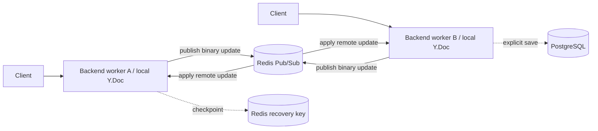

# Horizontal collaboration scaling

## V1 boundary

Concord deliberately runs one Uvicorn process. Each active session has one
authoritative in-memory `pycrdt.Doc`; Redis stores periodic recovery checkpoints
and PostgreSQL stores explicit saves. Running multiple backend workers today
would require load-balancer affinity by session ID. Cookie/IP affinity is not
sufficient because collaborators in one session are different users.

A process crash can lose edits made since the last Redis checkpoint. Reconnect
merges the last PostgreSQL save and the newest checkpoint. Redis is recovery
storage, not the live source of truth.

## V2 design

For every authorized local update, a worker applies it to its local document,
broadcasts it to local sockets, and publishes the raw update with an origin and
message ID to `concord:ydoc:v2:{session_id}`. Subscribers ignore their own
origin, validate size and framing, apply the remote update, and broadcast it
locally. Yjs updates are commutative and idempotent, so duplicate or reordered
delivery converges.

`backend/benchmarks/redis_fanout_prototype.py` implements and validates that
envelope plus the publish/subscription loop. It is intentionally not enabled in
the production path: Redis Pub/Sub has no replay or delivery acknowledgement.

## Production requirements

- Use Redis Streams (or another durable log) if an update must survive a worker
  disconnect; persist per-session consumer offsets and trim only after a durable
  checkpoint.
- Subscribe before accepting sockets and hydrate from PostgreSQL + the recovery
  checkpoint before consuming new updates.
- Fence restore/save/member-role operations with a distributed per-session lock
  or monotonic session epoch.
- Deduplicate by message ID with bounded retention and attach metrics for relay
  lag, dropped/invalid events, reconnects, and document-state divergence.
- Authenticate the Redis network, encrypt transport, cap message size, and never
  deserialize arbitrary Python objects.
- Compare V1 and V2 with `bench_websocket.py`; record cross-worker p95/p99
  overhead, convergence failures, and Redis memory/network utilization.

## Failure model

Pub/Sub loss while a subscriber is disconnected is the prototype's primary
gap. Redis failure should stop accepting writes or fall back to sticky routing;
silently allowing isolated worker documents would create temporary divergence.
PostgreSQL remains the durable explicit-save boundary, and restore remains a new
CRDT edit instead of replacing a live document instance.
